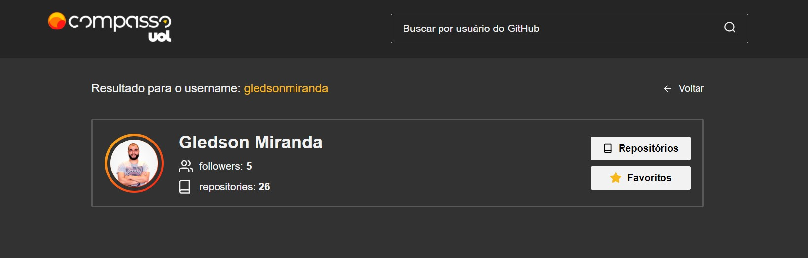

# Compasso Uol - GitHub API Front-end

- Buscar usuário pelo username;
- Acessar os repositórios do usuário, e os favoritos;

## `Projeto`

*Desktop*:\


*Mobile*:\


---
## Execução:
---

```
npm install
```

- Para instalar as dependências do projeto.
---

```
npm test
```

- Para rodar os testes feito com o Jest.

---

```
npm start
```

- Para rodar o projeto.

---

### `O que foi usado:`
- [React JS](https://pt-br.reactjs.org/) (Framework);
- [Sass](https://sass-lang.com/) (CSS modules);
- Jest (Para testes);


